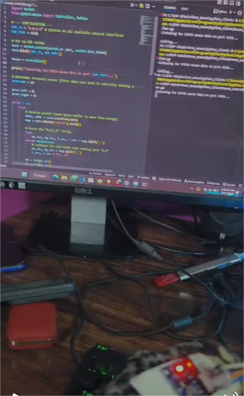

# Wireless ESP32 Air Mouse

This project turns an ESP32 and an MPU6050 accelerometer/gyroscope into a wireless air mouse. It uses a low-latency UDP connection over Wi-Fi to send motion and gesture data to a host machine (PC/Mac/Linux), where a Python script translates the data into actual cursor movements and clicks.



### System in Action
The setup image above demonstrates the complete end-to-end integration of the wireless mouse system in real time:
- **The Host PC (Monitor):** The Python script (`mouse_controller.py`) is open in the code editor, and the terminal pane reads `Listening for ESP32 mouse data on port 4210...`. This confirms that the UDP socket is successfully bound and actively monitoring the local network for traffic. 
- **The Hardware (Foreground):** The physical controller circuitry, which consists of the ESP32 microcontroller and MPU6050 sensor. It's powered on (indicated by the red LED) and actively reading physical motion data.
- **The Action:** As the ESP32 is physically moved across the table, it instantly broadcasts the measured gyroscope and accelerometer data over WiFi. The Python script intercepts these high-frequency network packets, parsing them and translating the raw hardware readings directly into smooth, real-time cursor shifts using the `pynput` framework.
## Features
- **Low Latency**: Uses UDP over Wi-Fi for fast, fire-and-forget data streaming.
- **Motion Tracking**: Maps real-time gyroscope data to smooth cursor movements at a 100Hz polling rate.
- **Gesture Control**: Detects sudden jerks for mouse clicks (Jerk Left = Left Click, Jerk Right = Right Click).
- **Deadzone Filtering**: The host Python client filters out small, unintentional hand jitters for improved precision.

## Hardware Requirements
- ESP32 Development Board
- MPU6050 Sensor Module (Accelerometer + Gyroscope)
- Jumper wires and an independent power source (e.g., Li-Ion battery or Power Bank)

### Wiring
Connect the MPU6050 to the default I2C pins of your ESP32:
* **VCC** -> 3.3V
* **GND** -> GND
* **SCL** -> GPIO 22 
* **SDA** -> GPIO 21

## Software Dependencies

### ESP32
Using the Arduino IDE, ensure you have:
- The `ESP32` board definitions installed.
- The `MPU6050` library by Electronic Cats (which utilizes `I2Cdev`).

### Host Computer (Python)
- Python 3.x
- `pynput` library (handles injecting the mouse movements directly to the operating system)

Install the Python dependency via pip:
```bash
pip install pynput
```

## Setup & Execution

### 1. Flash the ESP32
Open `esp32_mouse/esp32_mouse.ino` in your Arduino IDE. 
**Important**: Update the network configuration segment with your own router and computer details before compiling and uploading:

```cpp
// --- CONFIGURATION ---
const char* ssid = "YOUR_WIFI_SSID";
const char* password = "YOUR_WIFI_PASSWORD";
const char* pc_ip = "YOUR_PC_IP_ADDRESS";
```

Upload the sketch to your ESP32 and open the Serial Monitor (115200 baud) to ensure it connects to your WiFi and initializes the MPU6050 successfully.

### 2. Start the Receiver
On the machine you wish to control (make sure it's the same computer assigned to `YOUR_PC_IP_ADDRESS`), launch the host script:

```bash
cd python_client
python mouse_controller.py
```

### 3. Usage
Once the python script shows it is listening, your mouse cursor is ready to be controlled! 
- Move the breadboard/components to steer the cursor.
- Jerk sharply to the left to left-click.
- Jerk sharply to the right to right-click.

Troubleshooting Tip: If the mouse feels too sensitive or too sluggish, tweak the division factor `/ 150` on the raw X/Y lines within the Arduino code.