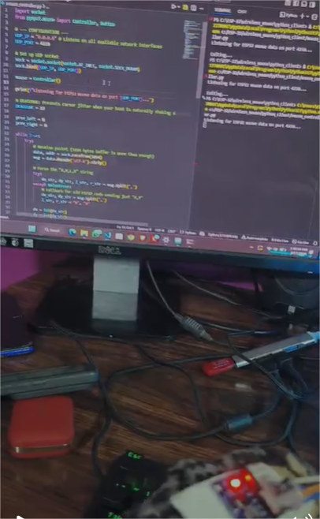

# Wireless ESP32 Air Mouse

> **Author & Creator:** [Shahriyar Taufik](https://github.com/DeathSHMASHER)  
> **GitHub:** [@DeathSHMASHER](https://github.com/DeathSHMASHER)  
> **Repository:** [DeathSHMASHER/Wireless-mouse-](https://github.com/DeathSHMASHER/Wireless-mouse-)

This project turns an ESP32, an MPU6050 accelerometer/gyroscope, and two TTP223 capacitive touch sensors into a wireless air mouse. It uses a low-latency UDP connection over Wi-Fi to send motion and touch data to a host machine (PC/Mac/Linux), where a Python script translates the data into actual cursor movements, clicks, and drag operations.



### System in Action
The setup image above demonstrates the complete end-to-end integration of the wireless mouse system in real time:
- **The Host PC (Monitor):** The Python script (`mouse_controller.py`) is open in the code editor, and the terminal pane reads `Listening for ESP32 mouse data on port 4210...`. This confirms that the UDP socket is successfully bound and actively monitoring the local network for traffic. 
- **The Hardware (Foreground):** The physical controller circuitry, which consists of the ESP32 microcontroller, MPU6050 sensor, and TTP223 capacitive touch sensors. It's powered on and actively reading physical motion and touch inputs.
- **The Action:** As the ESP32 is moved, it broadcasts gyroscope motion data alongside touch states over WiFi. The Python script intercepts these high-frequency network packets, parsing them and translating raw readings directly into smooth cursor shifts and clicks using `pynput`.

## Features
- **Low Latency**: Uses UDP over Wi-Fi for fast, fire-and-forget data streaming.
- **Motion Tracking**: Maps real-time gyroscope data to smooth cursor movements at a 100Hz polling rate.
- **Capacitive Touch Controls**: 2x TTP223 capacitive touch sensors for Left Click (tap to click, double tap, hold to drag) and Right Click (context menu).
- **Deadzone Filtering**: The host Python client filters out small, unintentional hand jitters for improved precision.

## Hardware Requirements
- ESP32 Development Board
- MPU6050 Sensor Module (Accelerometer + Gyroscope)
- 2x TTP223 Capacitive Touch Sensor Modules
- Jumper wires and an independent power source (e.g., Li-Ion battery or Power Bank)

### Wiring
Connect the components to your ESP32 as follows:

| Module | Module Pin | ESP32 Pin | Function |
| :--- | :--- | :--- | :--- |
| **MPU6050** | VCC | 3.3V | Power |
| | GND | GND | Ground |
| | SCL | **GPIO 22** | I2C Clock |
| | SDA | **GPIO 21** | I2C Data |
| **Touch 1 (TTP223)** | VCC | 3.3V | Power |
| | GND | GND | Ground |
| | I/O (OUT) | **GPIO 4** | **Left Click & Drag** |
| **Touch 2 (TTP223)** | VCC | 3.3V | Power |
| | GND | GND | Ground |
| | I/O (OUT) | **GPIO 18** | **Right Click** |

> **Note on TTP223 Jumpers:** Keep solder pads A and B unbridged (default). This sets the touch sensors in **Momentary Active-HIGH** mode (outputs 3.3V when touched).

## Software Dependencies

### ESP32
Using the Arduino IDE, ensure you have:
- The `ESP32` board definitions installed.
- The `MPU6050` library by Electronic Cats (which utilizes `I2Cdev`).

### Host Computer (Python)
- Python 3.x
- `pynput` library (handles injecting mouse movements and clicks directly into the OS)

Install the Python dependency via pip:
```bash
pip install pynput
```

## Setup & Execution

### 1. Flash the ESP32
Open `esp32_mouse/esp32_mouse.ino` in your Arduino IDE. 
**Important**: Update the network configuration segment with your own router and computer details before compiling and uploading:

```cpp
// --- CONFIGURATION ---
const char* ssid = "YOUR_WIFI_SSID";
const char* password = "YOUR_WIFI_PASSWORD";
const char* pc_ip = "YOUR_PC_IP_ADDRESS";
const int udp_port = 4210;
```

Upload the sketch to your ESP32 and open the Serial Monitor (115200 baud) to ensure it connects to your WiFi and initializes the sensors successfully.

### 2. Start the Receiver
On the machine you wish to control (make sure it's the same computer assigned to `YOUR_PC_IP_ADDRESS`), launch the host script:

```bash
cd python_client
python mouse_controller.py
```

### 3. Usage
Once the python script shows it is listening, your mouse cursor is ready to be controlled! 
- Move the ESP32 in the air to steer the cursor.
- Tap **Touch Sensor 1 (GPIO 4)** for **Left Click**; hold it down to **Drag**.
- Tap **Touch Sensor 2 (GPIO 18)** for **Right Click**.

Troubleshooting Tip: If the mouse feels too sensitive or too sluggish, tweak the division factor `/ 150` on the raw X/Y lines within the Arduino code.

## Author & Attribution

This project was engineered and developed by **Shahriyar Taufik**.

- **GitHub Profile:** [@DeathSHMASHER](https://github.com/DeathSHMASHER)
- **Repository:** [DeathSHMASHER/Wireless-mouse-](https://github.com/DeathSHMASHER/Wireless-mouse-)

### Attribution Requirement
Anyone using, forking, showcasing, or referencing this project (including in videos, articles, academic projects, or derivative codebases) **must** attribute the original author:
> **"Original project developed by Shahriyar Taufik ([@DeathSHMASHER](https://github.com/DeathSHMASHER))"**
